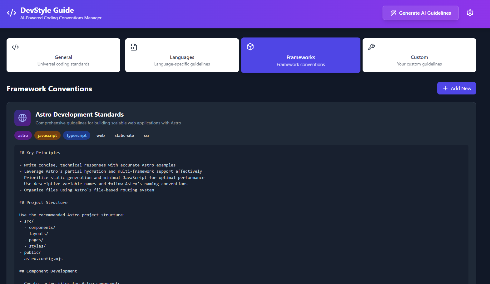

# AI Coding Conventions Manager

> [!NOTE]
> [Edit in StackBlitz next generation editor ⚡️](https://stackblitz.com/~/github.com/jimbrig/ai-coding-conventions-manager).

## Overview

This project is a tool to help manage coding conventions for AI projects.

It is a web application that allows users to create, edit, and delete coding conventions.

It also allows users to create, edit, and delete custom coding convention "sets" by general guidelines, language,
framework, and other categories.
